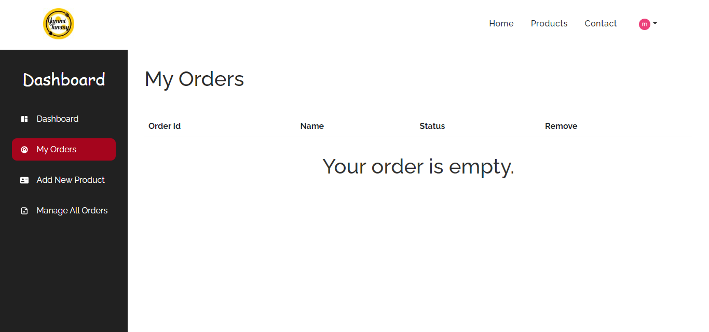

# Mern-Stack Yummy-Food-Delivery-website using React + Redux + Sass + Node js + express js + Mongodb etc.

- Firebase Authentication Register, login with email and password
- Quick login with google
- User can buy any product after login and he can see her dashoard
- User can mangae her order, add new product, manage all orders, delete orders
- Responsive for all devices

# Demo - (https://yummy-food-delivery.herokuapp.com/)

Interface -

Dashboard interface -

